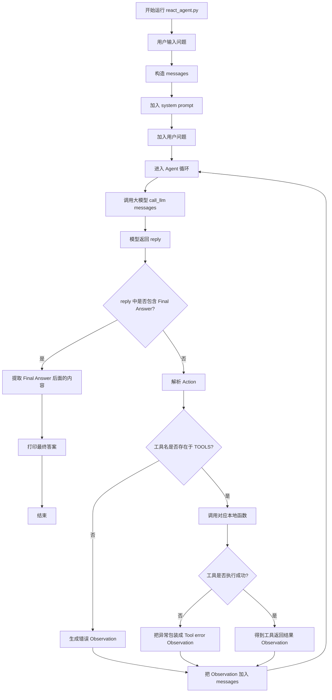

SmolAgents 实战解析（看它是如何用短短几十行代码让大模型跑 Python 脚本的）
手写一个原生 ReAct Agent（不依赖重型框架）

# Trajectory（执行轨迹）

理解 Agent（智能体）的底层执行逻辑，核心就是拆解它的 **Trajectory（执行轨迹）**

大多数现代 Agent 的底层轨迹都是基于 **ReAct (Reason + Act)** 框架或其变种构建

## ReAct (Reason + Act)

**初始化 (Initialization)：** 系统将用户的原始目标和可用的工具列表（Tools/APIs）输入给 Agent。

**推理 (Reasoning)：** LLM 根据当前目标和历史轨迹（上下文），生成当前的思考（$s_t$）。

**行动 (Acting)：** LLM 输出一个结构化的指令（如 JSON），决定调用哪个工具以及传入什么参数（$a_t$）。

**执行与观察 (Observation)：** 外部系统拦截这个工具调用指令，实际执行它，并将结果（$o_t$）作为新的上下文追加到 Agent 的记忆中。

**评估与循环 (Evaluation & Loop)：** Agent 审视新的观察结果。如果任务已完成，则输出最终答案并结束；如果未完成，则进入下一个循环。

**该任务的底层 Trajectory 记录如下：**

> **Step 1:**
>
> - $s_1$ **(Thought)**: 我需要先获取昨天苹果公司（AAPL）的收盘价。我应该调用金融搜索工具。
> - $a_1$ **(Action)**: `search_finance_api(ticker="AAPL", date="yesterday")`
> - $o_1$ **(Observation)**: `{"close_price": 185.20, "currency": "USD"}`
>
> **Step 2:**
>
> - $s_2$ **(Thought)**: 好的，昨天收盘价是 185.20 美元。用户要买 100 股，汇率是 7.2。我需要计算 185.20 * 100 * 7.2。我可以调用计算器工具确保准确。
> - $a_2$ **(Action)**: `calculator(expression="185.20 * 100 * 7.2")`
> - $o_2$ **(Observation)**: `133344.0`
>
> **Step 3 (Final):**
>
> - $s_3$ **(Thought)**: 我已经得到了所有信息，可以回答用户了。
> - $a_3$ **(Action)**: `finish(response="昨天苹果公司的收盘价为 185.20 美元。购买 100 股需要 133,344 元人民币。")`

这段完整的日志，就是一个标准的 Agent Trajectory。

**可解释性与调试 (Debuggability)：** 当 Agent 失败时（例如给出了错误的答案或陷入死循环），你无法仅通过最终输出排查问题。通过审查 Trajectory，你可以精准定位是“推理出错”（选错了工具）、“参数提取出错”（传错了参数），还是“观察理解出错”（环境返回了报错日志，但 LLM 没看懂）。

**反射与自我纠错 (Reflection / Self-Correction)：** 高阶的 Agent 会在执行过程中自我审查历史 Trajectory。如果 $o_t$ 返回了错误（例如代码运行引发 `SyntaxError`），Agent 可以在 $s_{t+1}$ 中意识到“我上一步的代码写错了”，从而在 $a_{t+1}$ 中生成修正后的代码。

**数据飞轮与微调 (Fine-tuning / SFT & RLHF)：** 高质量的 Agent Trajectory 是极其宝贵的训练数据。业界（如 OpenAI, Anthropic）正在使用大量的优秀轨迹记录来对基础模型进行监督微调（SFT）或强化学习（RLHF）。通过让模型学习这些“正确的思考路径”，可以显著提升其作为 Agent 的原生能力。

1、assistant 就是**模型自己上一轮的回复**。
2、第一轮的 question 不需要你手动解析，直接交给 LLM