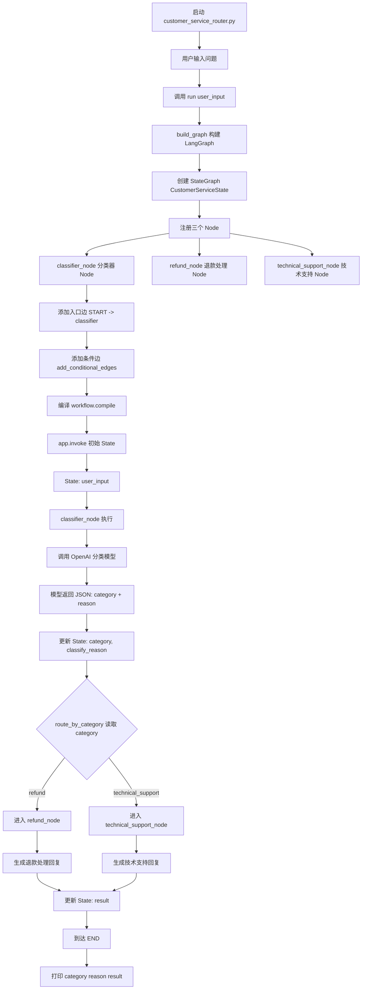

# Day 02

## State（状态）：Agent 的“全局共享记忆”

在多步交互中，Agent 需要记住“我刚才干了什么”以及“当前进展到哪了”。

State 是贯穿整个执行过程的上下文数据结构。在代码中，它通常是一个 Python 字典（`TypedDict`）或 Pydantic 模型。

它就像一个**共享的记事本**。每次流程流转时，这个记事本都会被传递给下一个执行单元。它不仅包含了最初的用户输入，还记录了 Agent 生成的所有中间变量（如：提取的参数、外部工具返回的网页内容、历史对话列表等）。

LangGraph 允许你定义这个状态是如何更新的。例如，对于“对话历史（Messages）”，更新机制是**追加（Append）**；对于“当前最终答案”，更新机制可能是**覆盖（Overwrite）**。

```
//初始 State 只有：
{
    "user_input": "我想申请退款"
}
//经过 classifier_node 后，它返回：
{
    "category": "refund",
    "classify_reason": "User wants a refund."
}
//angGraph 会把它合并进原来的 State。
```


## Nodes（节点）：Agent 的“执行单元”

有了记录状态的记事本，还需要有人去上面写东西、做任务。

在图结构中，Node 代表实际执行动作的函数（Python Function）或具体的 LLM 调用。

Node 是 Agent 工作流中的**干活担当**。它接收当前的 `State` 作为输入，执行特定的逻辑，然后返回一个对 `State` 的更新。

**Agent Node（大脑节点）**：接收上下文，调用大语言模型进行思考和决策。

**Tool/Action Node（工具节点）**：执行具体的外部动作，比如调用谷歌搜索 API 或运行 Python 脚本，并将结果存回 State 中。

```
workflow.add_node("classifier", classifier_node)
workflow.add_node("refund_handler", refund_node)
workflow.add_node("technical_support_handler", technical_support_node)
```

```
//调用了大模型去分类，模型有可能输出不是这两个分类的内容。
data = call_classifier_llm(user_input)
//这边做一个兜底
if category not in ("refund", "technical_support"):
        # 即使模型输出异常，也不要让流程失控。
        # 这里做一个保守兜底，把未知分类交给技术支持节点处理。
        category = "technical_support"

    return {
        "category": category,
        "classify_reason": data.get("reason", "No reason returned."),
    }
```


## Edges（边）：Agent 的“控制流与决策路由”

既然有多个节点，它们应该按什么顺序执行？这就是 Edges 负责的事情。

Edge 决定了图中节点之间的连接逻辑和执行先后顺序。

**普通边（Normal Edges）**：强制性的流转。比如 `A -> B`，表示 A 节点执行完后，百分之百流转到 B 节点（例如：工具执行完毕后，强制回传给大模型节点进行结果分析）。

**条件边（Conditional Edges）（🌟最核心）**：动态路由。它是一个基于当前 `State` 进行判断的函数。比如，Agent Node（大脑）输出完毕后，**条件边**会检查它的输出。

```
classifier Node 执行完
        ↓
调用 route_by_category(state)
        ↓
读取 state["category"]
        ↓
根据 category 决定下一个 Node
```


这样可以清楚知道每个请求进入了哪个分支，也方便后续加入人工审核、日志记录、权限校验或工单系统。


