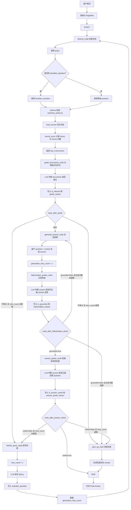

# Agentic RAG（具备推理与纠错能力的知识库）

传统 RAG（检索增强生成）最大的痛点就是“傻瓜式检索”：用户提问 ，向量数据库硬匹配 Top-K 文本块 ，丢给大模型生成。整个过程是单向的、盲目的。如果检索到的切片（Chunks）不相关、有噪音，或者回答不完整，大模型只会“将错就错”，产生严重的幻觉或无意义回答。

**Agentic RAG（以 Self-RAG 和 Corrective RAG 为核心）**，则是把传统的单向流水线升级为一个**具备“自主推理、自我评估、主动纠错”能力的闭环状态机**。

## 核心架构：Self-RAG / Corrective RAG 的四大核心环节

在 LangGraph 或 LlamaIndex 的实战中，Agentic RAG 通常由一个包含评估节点（Graders）的图（Graph）来实现。它将检索、评估、修正和生成解耦成四个关键步骤。

### 检索 (Retrieve)

**执行**：根据用户输入的 Query 正常从向量数据库中检索文档切片。

**不同点**：在 Agentic RAG 中，这只是一个 Node，检索出来的结果会被打包存入全局 `State`，等待后续节点严苛的“质检”。

因为它只是个 Node，它执行完后，控制权就交给了图的边（Edge）。Edge 会像传送带一样，把包含了新资料的 `State` 运送到下一个 Node（即“质检员” Document Grader）。


### 文档相关性评估 (Document Grader) — 解决“检索质量”问题

**底层逻辑**：这是一个专门的 LLM 节点，它不负责回答问题，只负责当“质检员”。它会逐一对比 `Query` 和每个检索出来的 `Chunk`，并输出结构化的布尔值（如 `{"relevance": "yes"/"no"}`）。

**路由策略（Conditional Edges）**：

**全部相关** ：直接路由到**生成节点**。

**存在不相关/噪音** ：过滤掉垃圾切片，将剩余有用的信息送去生成。

**完全不相关/信息不足**： 触发**纠错机制**（转去外部网页搜索或 Query 改写）。

```
//1.读取 business_policy.txt (line 1)，然后按每个 ## 标题切分。
//2.检索时是在这里逐个 chunk 计算分数。
def retrieve(query: str, top_k: int = 2) -> list[dict]:
    scored = []
    for chunk in load_chunks():
        score = lexical_score(query, f"{chunk['title']}\n{chunk['content']}")
        scored.append({**chunk, "score": score})
//3.然后排序，取前两个
scored.sort(key=lambda item: item["score"], reverse=True)
return scored[:top_k]
//4.把 top-k documents 一起交给 grader，让它输出一个总判断
```


### 外部纠错与扩写 (Web Search / Rewrite) — 解决“知识缺口”问题

**底层逻辑**：当本地知识库由于未覆盖、索引失效等原因导致检索失败时，Agent 会开启主动纠错：

**Query Rewrite**：将用户原始、模糊的提问，改写为更适合搜索引擎的关键词。

**Web Search**：调用外部 API（如 Tavily, Google Search）获取互联网实时、权威的数据作为补充，强行将流程拉回正确轨道。

```
def route_after_grade(state: RagState) -> Route:
    if state.get("is_relevant"):       //1.如果文档相关，进入 generate_answer
        return "generate"

    retry_count = state.get("retry_count", 0)   //2.如果文档不相关，并且还没超过最大重试次数，进入 rewrite_query
    if retry_count >= MAX_RETRIES:     //3.如果已经重试太多次，进入 give_up
        return "give_up"

    return "rewrite"
```

```
def rewrite_query_node(state: RagState) -> RagState:    
//如果已经有 rewritten_question，就继续基于 rewritten_question 改写，否则使用原始 question。
    current_question = state.get("rewritten_question") or state["question"]
    retry_count = state.get("retry_count", 0) + 1
```

```
//接着优先尝试调用 LLM 改写
llm_rewrite = call_llm_json(
    "你是 RAG 查询改写器。只返回 JSON："
    '{"rewritten_question": "更适合检索业务文档的问题"}',
    {
        "original_question": state.get("original_question", state["question"]),
        "current_question": current_question,
        "grade_reason": state.get("grade_reason", ""),
        "retry_count": retry_count,
    },
)
```


### 生成与“双重幻觉检查” (Generation & Hallucination Grader) — 解决“生成质量”问题

#### **Hallucination Grader**幻觉检查

生成的答案是否能够**完全被 Context 推导出来**（Grounding），如果大模型在回答中夹带了私货（Context 里没有的知识），判定为有幻觉，打回重写。

```
//1.生成答案先发生在 generate_answer_node
llm_answer = call_llm_text(
    "你是企业知识库客服助手。只能基于给定文档回答；如果文档没有依据，要说明无法确认。",
    {"question": question, "context": context},
)
//2.幻觉检查在这里
def hallucination_grader_node(state: RagState) -> RagState:
//3.调用 LLM 做 grounding 检查
grade = call_llm_json(
    "你是 RAG 幻觉检查器。判断 answer 是否完全能被 context 支撑。"
    "如果 answer 中有 context 没有依据的事实、数字、规则或承诺，就判定为不 grounded。"
    '只返回 JSON：{"is_grounded": true/false, "reason": "简短原因"}',
    {
        "question": state.get("original_question", state["question"]),
        "context": context,
        "answer": state["answer"],
    },
)
```

```
def route_after_hallucination_check(state: RagState) -> HallucinationRoute:
    if state.get("is_grounded"):
        return "check_answer"       //1.如果答案完全被 Context 支撑，进入 answer_grader
    if state.get("generation_retry_count", 0) >= MAX_GENERATION_RETRIES:  //2.如果答案没答到点，但还能重试
        return "give_up"            //3.如果检索/改写已经超限，give_up
    return "regenerate"
```


#### **Answer Grader**答案有效性检查

是否真正回答了问题（Answer Grader），如果答案没有正面回答问题，判定为无效，**重新触发检索或提示词修正**。

```
//1.答案有效性检查在这里
def answer_grader_node(state: RagState) -> RagState:
grade = call_llm_json(
    "你是 RAG 答案有效性检查器。判断 answer 是否正面回答了 question 的核心诉求。"
    "只检查答案是否有用、具体、切题；不要检查事实来源。"
    '只返回 JSON：{"is_useful": true/false, "reason": "简短原因"}',
    {
        "question": state.get("original_question", state["question"]),
        "answer": state["answer"],
    },
)
```

```
generate_answer
  ↓
hallucination_grader
  ↓
is_grounded?
  ├── false -> generate_answer 重新生成
  ├── false 且超过次数 -> give_up
  └── true -> answer_grader
              ↓
            is_answer_useful?
              ├── true -> END
              ├── false -> rewrite_query -> retrieve
              └── false 且超过次数 -> give_up
```


