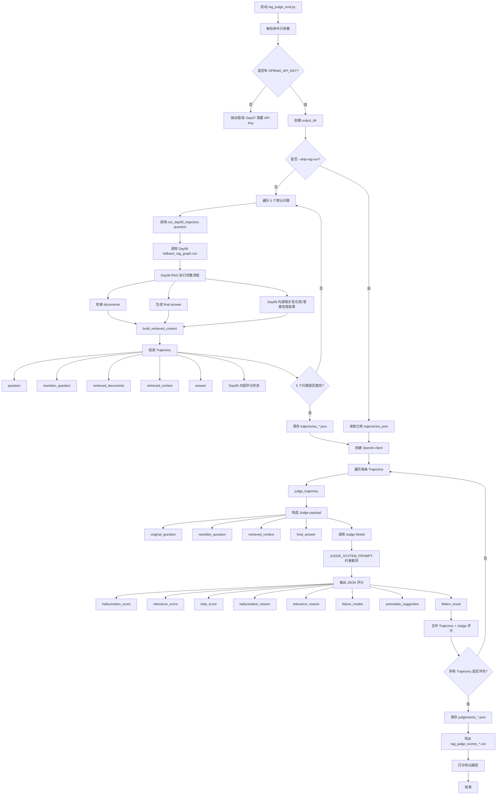

# 终极挑战——自动化评测与 LLM-as-a-Judge

## 为什么必须用 LLM-as-a-Judge？

在传统的 NLP 任务中，我们通常使用 BLEU 或 ROUGE 这样的指标来对比“机器翻译”和“标准答案”的重合度。

**LLM-as-a-Judge 的核心思想**：用一个能力更强的大模型（通常是 GPT-4o 或 Claude 3.5 Sonnet）来作为裁判。给裁判输入具体的打分规则（Rubrics），让它去“阅读理解”我们系统的输出，并给出评分和理由。裁判模型关心的是**语义一致性**，而不是字面一致性。


##  Ragas 评测框架入门：RAG 系统的四大“体检指标”

**Ragas (Retrieval Augmented Generation Assessment)** 是目前业界最主流的 RAG 评测框架。它把对 RAG 系统的评估拆解成了两个独立维度的四个核心指标。

理解 Ragas，你需要时刻关注三要素：**用户提问 (Question) + 检索到的切片 (Context) + 模型最终回答 (Answer)**。

### 维度一：评估生成质量 (Generation) —— “大模型有没有胡说八道？”

#### Faithfulness (忠实度 / 事实一致性)

**衡量什么**：生成的 Answer 是否完全基于检索到的 Context 推导出来？有没有夹带私货（幻觉）？

**评测逻辑控制**：在传统的视觉任务中（比如评估视频行为识别算法），为了确保评估的准确性并过滤噪音，系统通常会将误报检测严格限制在标注好的起始和结束时间范围内，忽略时间范围外的干扰。Faithfulness 的逻辑与此高度一致：裁判模型会将评估**严格限制在检索出的 Context 边界内**。如果 Answer 中出现了 Context 里没有的信息，就会被判定为幻觉，忠实度扣分。

```
用户问题
  ↓
Day06 RAG 检索 business_policy.txt
  ↓
得到 documents
  ↓
Day07 把 documents 拼成 retrieved_context
  ↓
交给 Judge 评估 final_answer
```

只看 retrieved_context，不要使用外部知识，Answer 中只要有 Context 没支撑的信息，就算幻觉风险。

```
//检索到的每个 chunk 会被拼成[chunk-1 | 退款政策 | score=...]
def build_retrieved_context(documents: list[dict[str, Any]]) -> str:
    chunks = []
    for doc in documents:
        chunks.append(
            f"[{doc.get('id')} | {doc.get('title')} | score={doc.get('score')}]\n"
            f"{doc.get('content')}"
        )
    return "\n\n".join(chunks)
```

所以 Judge 看到的不是整个知识库，而是 **本次 RAG 实际检索出来的 Context**。


#### Answer Relevance (回答相关性)

**衡量什么**：生成的 Answer 有没有正面回答用户的 Question？

**评测逻辑**：裁判模型会根据 Answer 反向生成几个可能的问题。如果反向生成的问题和用户原始的 Question 高度一致，说明回答一针见血；如果不一致，说明模型在“顾左右而言他”。


### 维度二：评估检索质量 (Retrieval) —— “搜出来的东西对不对？”

#### Context Precision (上下文精确度)

**衡量什么**：系统检索出来的 Top-K 个切片中，真正有用的信息是不是排在最前面？

**评测逻辑**：如果极其关键的信息被排在了第 5 位，大模型可能因为注意力衰减而忽略它。精确度高意味着“好钢用在了刀刃上”。


#### Context Recall (上下文召回率)

**衡量什么**：为了完美回答这个问题，需要的所有知识，系统都检索出来了吗？

**评测逻辑**：裁判模型会对比 Ground Truth（专家写的标准答案）和检索到的 Context。如果标准答案里有 3 个关键点，而 Context 只覆盖了 1 个，说明检索漏东西了，召回率低。


## 拿下 JD 的核心：如何构建“评测闭环”

### 数据合成 (Synthetic Data Generation)

**痛点**：手动写 500 个测试问答对太耗时了。

**闭环方案**：利用 LLM 逆向操作。把你现有的文档库喂给大模型，让它基于这些文档自动生成几百个 `[Question, Ground_Truth]` 对。这就是你的黄金测试集（Golden Dataset）。

### 批量执行与监控 (Execution)

编写一个 `run_eval` 脚本，让你的 RAG 系统自动化回答这 500 个问题，并记录下每次检索的 `Context` 和生成的 `Answer`。

### 自动化打分 (Automated Scoring)

将跑出来的日志接入 Ragas 框架，调用 LLM-as-a-Judge。几分钟后，你会得到一个包含上述四个指标的雷达图和详细的数据报表。

### 迭代与寻优 (Optimization) —— 告别盲目调参

**发现 Faithfulness 分数低** 说明大模型容易放飞自我，你需要修改生成节点的 Prompt，强调“严格基于上下文作答”。

**发现 Context Recall 分数低**说明没搜全。你需要回去调整 Chunking（分块）策略，或者引入查询改写（Query Rewrite）。

**修改完毕后，一键重新运行整个测试集**，通过对比两次的分数变化，你就能确信你的改动是真正有效（Solid）的。




